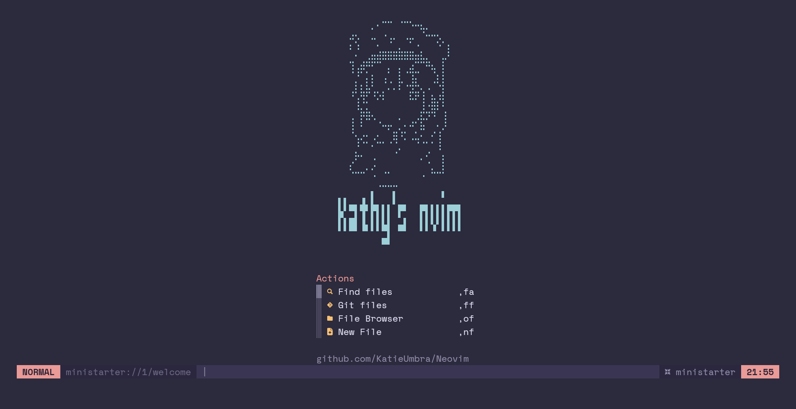
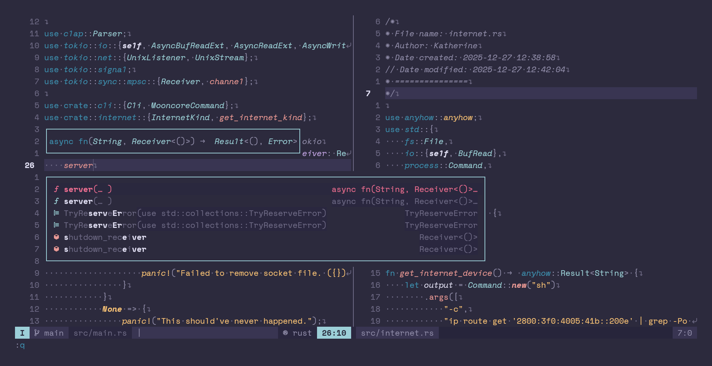

<div align="center">

# Katherine's minimal neovim config

<a href="https://dotfyle.com/KatieUmbra/neovim"></a>




**Truly minimal, with a builtin-first design philosphy, no bloat, no nonsense**

</div>

## Install Instructions

 > Install requires Neovim 0.12.0+. Always review the code before installing a configuration.

Clone the repository and run the install script (Only works on Arch):

```sh
git clone git@github.com:KatieUmbra/Neovim ~/.config/KatieUmbra/Neovim
chmod +x ./installer.sh
./installer.sh
```

Open Neovim with this config:
**KEEP IN MIND THAT IT COULD TAKE A MINUTE TO OPEN THE FIRST TIME**,
if it freezes or appears to not work, just wait for a bit, this is the only time you need to worry about this

```sh
NVIM_APPNAME=KatieUmbra/Neovim/ nvim
```

## Configuration

I focused on making this config highly configurable, look for every file inside `lua/options`

### Keymap

Most of the keybindings can be changed straight from the `lua/options/keymap.lua` file

### Vim

You can change `lua/options/vim.lua` to set vim options, both `vim.o` and `vim.g` are all defined there

### General

`lua/options/general.lua` has all the added configurations, they change things all over the config

- Colorscheme

You can choose a colorscheme between `rosepine`, `catppuccin`, and `nord`, aswell as a variant

**rosepine** has `dawn`, `moon` and `default`

**catppuccin** has `latte`, `frappe`, `macchiato` and `mocha`

**nord** only has `default`

note that for using a light theme, like catppuccin-latte or rosepine-dawn, you need to change `M.brightness` to `light` (it maps to `vim.o.background`)

- Languages

the `M.languages` field contains all the enabled languages in the config,
setting a language to `false` will both disable the language server AND the formatter,
this however does NOT disable language specific plugins (eg. crates, rustacean, clang-tools)

- Formatters

In the rare ocassion you do not want to disable the language server, but want to disable a specific
formatter, you can set a formatter in `M.formatters` to `false` to disable the formatter ONLY

## Plugins

### colorscheme

+ [gbprod/nord.nvim](https://dotfyle.com/plugins/gbprod/nord.nvim)
+ [rose-pine/neovim](https://dotfyle.com/plugins/rose-pine/neovim)
+ [catppuccin/nvim](https://dotfyle.com/plugins/catppuccin/nvim)
### completion

+ [saghen/blink.cmp](https://dotfyle.com/plugins/saghen/blink.cmp)
### file-explorer

+ [stevearc/oil.nvim](https://dotfyle.com/plugins/stevearc/oil.nvim)
### formatting

+ [stevearc/conform.nvim](https://dotfyle.com/plugins/stevearc/conform.nvim)
### lsp

+ [mrcjkb/rustaceanvim](https://dotfyle.com/plugins/mrcjkb/rustaceanvim)
+ [neovim/nvim-lspconfig](https://dotfyle.com/plugins/neovim/nvim-lspconfig)
### nvim-dev

+ [saghen/blink.lib](https://dotfyle.com/plugins/saghen/blink.lib)
+ [folke/lazydev.nvim](https://dotfyle.com/plugins/folke/lazydev.nvim)
### syntax

+ [nvim-treesitter/nvim-treesitter](https://dotfyle.com/plugins/nvim-treesitter/nvim-treesitter)
## Language Servers

+ clangd
+ cmake
+ cssls
+ dockerls
+ gleam
+ html
+ lua_ls
+ neocmake
+ ols
+ rust_analyzer
+ sqlls
+ svelte
+ tailwindcss
+ taplo
+ vimls
+ vtsls
+ yamlls
+ zls

Most of this readme was generated by [Dotfyle](https://dotfyle.com)
